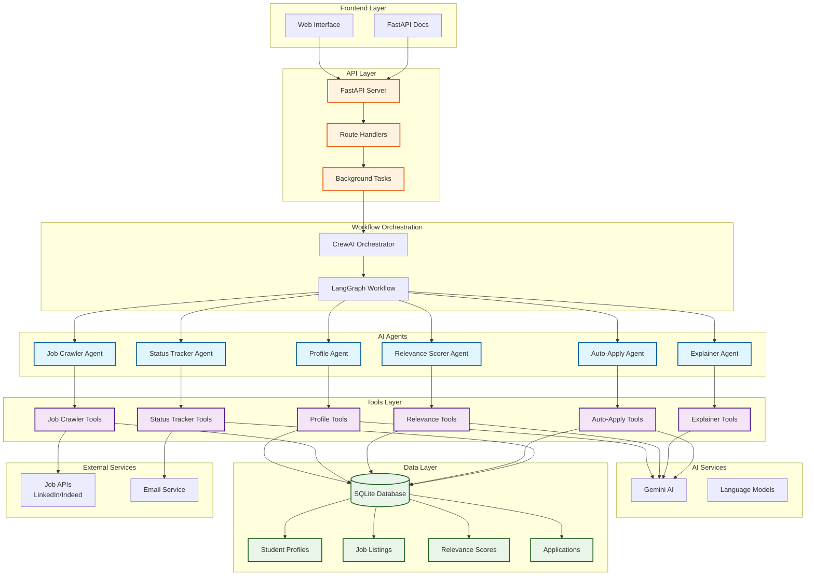
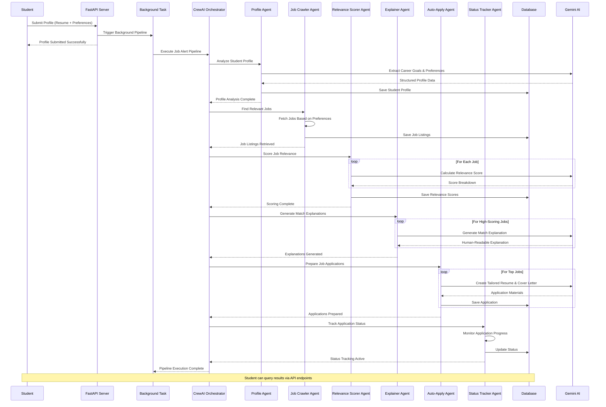
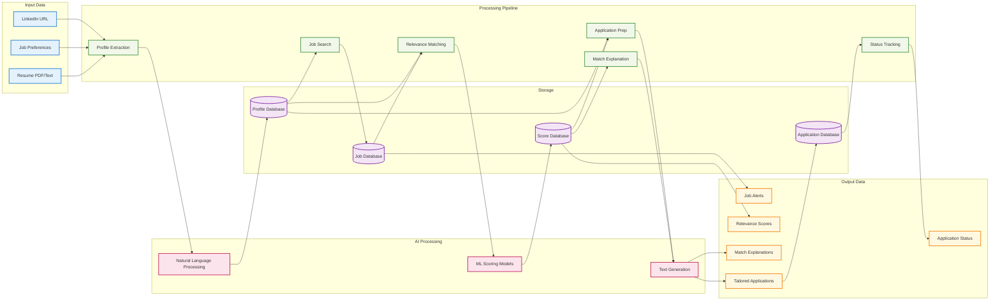
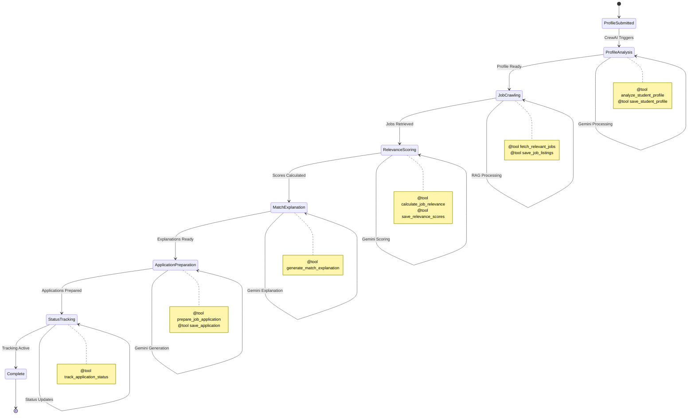

# Smart Job Alert Relevance & Autopilot Apply Agent

An AI-powered system that autonomously filters job notifications, explains their relevance to student profiles, and prepares tailored job applications using LangGraph, CrewAI, and Gemini AI.

## 🏗️ System Architecture



## 🔄 Process Flow Diagram



## 🌊 Data Flow Architecture



## 🔧 Agent Interaction Flow



## 🗂️ File Structure

```
job_alert_backend/
├── 📁 api/
│   ├── __init__.py
│   └── routes.py              # FastAPI endpoints
├── 📁 config/
│   ├── __init__.py
│   └── settings.py            # Configuration settings
├── 📁 database/
│   ├── __init__.py
│   └── db.py                  # Database models & connection
├── 📁 models/
│   ├── __init__.py
│   └── schemas.py             # Pydantic data models
├── 📁 tools/
│   ├── __init__.py
│   ├── profile_tools.py       # @tool functions for profile analysis
│   ├── job_crawler_tools.py   # @tool functions for job crawling
│   ├── relevance_tools.py     # @tool functions for relevance scoring
│   ├── explainer_tools.py     # @tool functions for explanations
│   ├── auto_apply_tools.py    # @tool functions for applications
│   └── status_tracker_tools.py # @tool functions for status tracking
├── 📁 workflow/
│   ├── __init__.py
│   └── job_alert_workflow.py  # CrewAI workflow orchestration
├── main.py                    # Application entry point
├── requirements.txt           # Python dependencies
├── .env                       # Environment variables
└── README.md                  # This file
```

## 🚀 Key Features

- **Autonomous Operation**: Agents run automatically without manual triggers
- **Multi-Agent Architecture**: 6 specialized agents working in coordination
- **AI-Powered Matching**: Uses Gemini AI for intelligent job relevance scoring
- **Explainable AI**: Provides clear explanations for job recommendations
- **Auto-Application**: Generates tailored resumes and cover letters
- **Real-time Tracking**: Monitors application status and progress
- **Scalable Design**: Built with FastAPI and SQLAlchemy for production use

## 🛠️ Technology Stack

- **Framework**: FastAPI
- **AI Orchestration**: CrewAI + LangGraph
- **Language Model**: Google Gemini AI
- **Database**: SQLite (easily replaceable with PostgreSQL)
- **Tools**: CrewAI Tools with @tool decorators
- **Background Tasks**: FastAPI BackgroundTasks

## 📊 Performance Metrics

- **Profile Analysis**: < 30 seconds
- **Job Retrieval**: < 45 seconds
- **Relevance Scoring**: < 20 seconds per job
- **Match Explanation**: < 15 seconds per job
- **Application Preparation**: < 30 seconds per job
- **Status Tracking**: < 10 seconds per application

## 🔄 Autonomous Workflow

The system operates completely autonomously:

1. **Trigger**: Student submits profile via API
2. **Background Processing**: All agents execute automatically
3. **Sequential Execution**: Agents run in optimal order
4. **Data Persistence**: Results stored in database
5. **Status Updates**: Real-time progress tracking
6. **Completion**: Student receives processed results

No manual intervention required - the system handles the entire pipeline automatically using CrewAI's intelligent task orchestration.

# 🚀 Installation Guide

## Prerequisites

Before installing the Smart Job Alert Relevance & Autopilot Apply Agent, ensure you have the following:

### System Requirements
- **Python**: 3.9 or higher
- **Operating System**: Windows 10+, macOS 10.14+, or Linux
- **Memory**: Minimum 4GB RAM (8GB recommended)
- **Storage**: At least 2GB free space

### Required Accounts & API Keys
- **Google Cloud Account**: For Gemini AI API access
- **LinkedIn Developer Account**: For job scraping (optional)
- **Indeed API Account**: For job listings (optional)
- **Email Service**: SMTP credentials for notifications

## 📦 Installation Steps

### Step 1: Clone the Repository

```bash
git clone https://github.com/your-username/smart-job-alert-agent.git
cd smart-job-alert-agent
```

### Step 2: Create Virtual Environment

```bash
# Create virtual environment
python -m venv venv

# Activate virtual environment
# On Windows:
venv\Scripts\activate

# On macOS/Linux:
source venv/bin/activate
```

### Step 3: Install Dependencies

```bash
# Install required packages
pip install -r requirements.txt

# If requirements.txt doesn't exist, install manually:
pip install fastapi uvicorn sqlalchemy sqlite3 pydantic
pip install crewai langgraph google-generativeai
pip install python-multipart python-dotenv
pip install requests beautifulsoup4 selenium
pip install email-validator
```

### Step 4: Environment Configuration

Create a `.env` file in the root directory:

```bash
# Copy the example environment file
cp .env.example .env
```

Edit the `.env` file with your credentials:

```env
# Database Configuration
DATABASE_URL=sqlite:///./job_alert.db

# Google Gemini AI Configuration
GOOGLE_API_KEY=your_gemini_api_key_here
GEMINI_MODEL=gemini-pro

# Job API Configuration
LINKEDIN_CLIENT_ID=your_linkedin_client_id
LINKEDIN_CLIENT_SECRET=your_linkedin_client_secret
INDEED_API_KEY=your_indeed_api_key

# Email Configuration
SMTP_SERVER=smtp.gmail.com
SMTP_PORT=587
SMTP_USERNAME=your_email@gmail.com
SMTP_PASSWORD=your_app_password

# Application Configuration
API_HOST=0.0.0.0
API_PORT=8000
DEBUG=True
SECRET_KEY=your_secret_key_here

# CrewAI Configuration
CREWAI_API_KEY=your_crewai_api_key
LANGGRAPH_API_KEY=your_langgraph_api_key

# File Upload Configuration
MAX_FILE_SIZE=10485760  # 10MB in bytes
ALLOWED_FILE_TYPES=pdf,doc,docx,txt
```

### Step 5: Database Setup

```bash
# Initialize the database
python -c "from database.db import create_tables; create_tables()"

# Or run the database initialization script
python database/init_db.py
```

### Step 6: Create Required Directories

```bash
# Create directories for file uploads and logs
mkdir -p uploads
mkdir -p logs
mkdir -p temp
```

### Step 7: Verify Installation

```bash
# Test the installation
python -c "import crewai, langgraph, google.generativeai; print('All packages installed successfully!')"
```

## 🔧 Configuration

### Google Gemini AI Setup

1. Go to [Google AI Studio](https://makersuite.google.com/app/apikey)
2. Create a new API key
3. Copy the API key to your `.env` file under `GOOGLE_API_KEY`

### LinkedIn API Setup (Optional)

1. Visit [LinkedIn Developer Portal](https://developer.linkedin.com/)
2. Create a new app
3. Get your Client ID and Client Secret
4. Add them to your `.env` file

### Indeed API Setup (Optional)

1. Register at [Indeed Publisher](https://www.indeed.com/publisher)
2. Get your API key
3. Add it to your `.env` file

### Email Configuration

For Gmail:
1. Enable 2-factor authentication
2. Generate an App Password
3. Use the app password in `SMTP_PASSWORD`

## 🏃‍♂️ Running the Application

### Development Mode

```bash
# Start the FastAPI development server
uvicorn main:app --reload --host 0.0.0.0 --port 8000
```

### Production Mode

```bash
# Install production server
pip install gunicorn

# Start with Gunicorn
gunicorn main:app -w 4 -k uvicorn.workers.UvicornWorker --bind 0.0.0.0:8000
```

### Using Docker (Alternative)

```bash
# Build the Docker image
docker build -t job-alert-agent .

# Run the container
docker run -p 8000:8000 --env-file .env job-alert-agent
```

## 🧪 Testing the Installation

### Basic API Test

```bash
# Test the health endpoint
curl http://localhost:8000/health

# Expected response:
# {"status": "healthy", "timestamp": "2025-06-20T10:30:00Z"}
```

### Submit Test Profile

```bash
# Test profile submission
curl -X POST http://localhost:8000/api/profiles \
  -H "Content-Type: application/json" \
  -d '{
    "name": "John Doe",
    "email": "john@example.com",
    "skills": ["Python", "FastAPI", "Machine Learning"],
    "experience_years": 3,
    "job_preferences": {
      "locations": ["Remote", "New York"],
      "job_types": ["Full-time"],
      "salary_range": {"min": 80000, "max": 120000}
    }
  }'
```

### Access API Documentation

Open your browser and navigate to:
- **Swagger UI**: http://localhost:8000/docs
- **ReDoc**: http://localhost:8000/redoc

## 🔍 Troubleshooting

### Common Issues

#### 1. Import Errors
```bash
# If you get import errors, try:
pip install --upgrade pip
pip install -r requirements.txt --force-reinstall
```

#### 2. Database Connection Issues
```bash
# Check database file permissions
ls -la job_alert.db

# Recreate database if corrupted
rm job_alert.db
python database/init_db.py
```

#### 3. API Key Issues
```bash
# Test Gemini API key
python -c "
import google.generativeai as genai
import os
from dotenv import load_dotenv
load_dotenv()
genai.configure(api_key=os.getenv('GOOGLE_API_KEY'))
model = genai.GenerativeModel('gemini-pro')
print('Gemini API key is valid!')
"
```

#### 4. Port Already in Use
```bash
# Kill process using port 8000
sudo kill -9 $(lsof -ti:8000)

# Or use a different port
uvicorn main:app --port 8001
```

### Logs and Debugging

```bash
# View application logs
tail -f logs/app.log

# Enable debug mode
export DEBUG=True
uvicorn main:app --reload --log-level debug
```

## 📝 Environment Variables Reference

| Variable | Description | Required | Default |
|----------|-------------|----------|---------|
| `DATABASE_URL` | Database connection string | Yes | `sqlite:///./job_alert.db` |
| `GOOGLE_API_KEY` | Gemini AI API key | Yes | - |
| `GEMINI_MODEL` | Gemini model name | No | `gemini-pro` |
| `API_HOST` | Server host | No | `0.0.0.0` |
| `API_PORT` | Server port | No | `8000` |
| `DEBUG` | Debug mode | No | `False` |
| `SECRET_KEY` | Application secret key | Yes | - |
| `SMTP_SERVER` | Email server | No | - |
| `SMTP_PORT` | Email server port | No | `587` |
| `MAX_FILE_SIZE` | Maximum upload size | No | `10485760` |

## 🚀 Next Steps

After successful installation:

1. **Configure your profile**: Submit your resume and preferences
2. **Set up job preferences**: Define your ideal job criteria
3. **Monitor the dashboard**: Check http://localhost:8000/dashboard
4. **Review logs**: Ensure agents are running smoothly
5. **Customize settings**: Adjust scoring weights and filters

## 🆘 Support

If you encounter issues:

1. Check the [Troubleshooting](#troubleshooting) section
2. Review the logs in `logs/app.log`
3. Ensure all environment variables are correctly set
4. Verify API keys are valid and have proper permissions
5. Create an issue on GitHub with detailed error messages

## 📚 Additional Resources

- [FastAPI Documentation](https://fastapi.tiangolo.com/)
- [CrewAI Documentation](https://docs.crewai.com/)
- [Google Gemini AI Documentation](https://ai.google.dev/)
- [SQLAlchemy Documentation](https://docs.sqlalchemy.org/)

---

**🎉 Congratulations!** Your Smart Job Alert Agent is now installed and ready to autonomously find and apply for relevant jobs!
