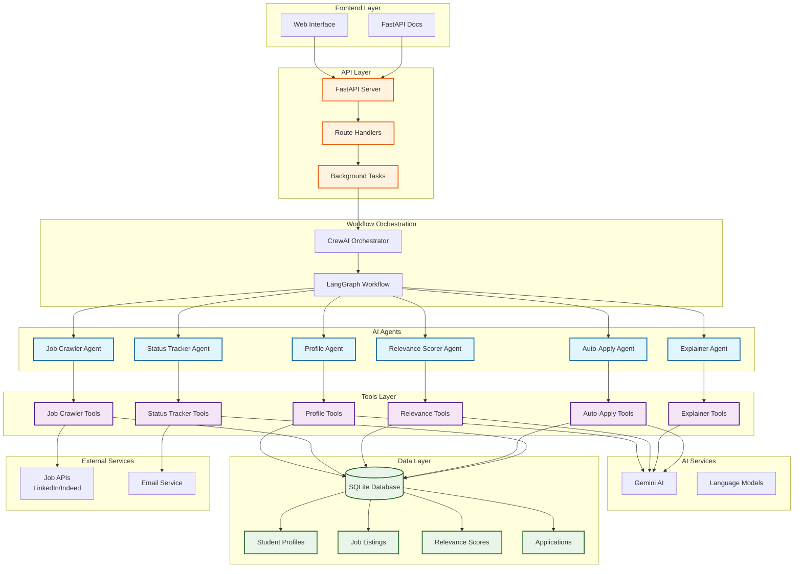
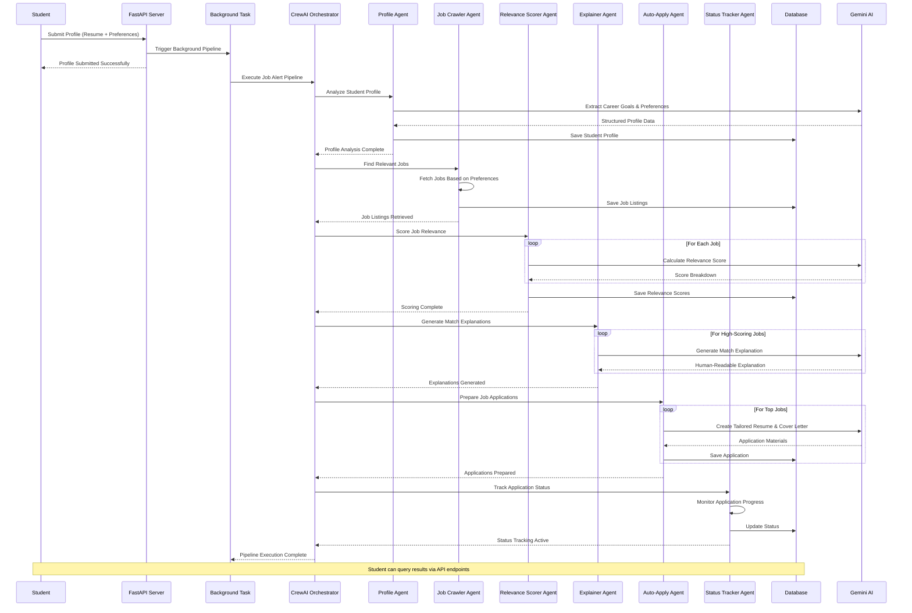
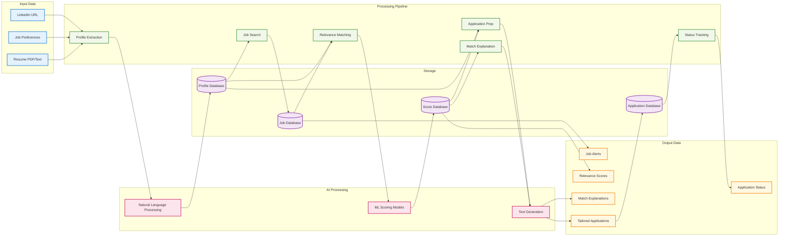

# Smart Job Alert Relevance & Autopilot Apply Agent

An AI-powered system that autonomously filters job notifications, explains their relevance to student profiles, and prepares tailored job applications using LangGraph, CrewAI, and Gemini AI.

## 🏗️ System Architecture



## 🔄 Process Flow Diagram



## 🌊 Data Flow Architecture



## 🔧 Agent Interaction Flow


## 🗂️ File Structure

```
job_alert_backend/
├── 📁 api/
│   ├── __init__.py
│   └── routes.py              # FastAPI endpoints
├── 📁 config/
│   ├── __init__.py
│   └── settings.py            # Configuration settings
├── 📁 database/
│   ├── __init__.py
│   └── db.py                  # Database models & connection
├── 📁 models/
│   ├── __init__.py
│   └── schemas.py             # Pydantic data models
├── 📁 tools/
│   ├── __init__.py
│   ├── profile_tools.py       # @tool functions for profile analysis
│   ├── job_crawler_tools.py   # @tool functions for job crawling
│   ├── relevance_tools.py     # @tool functions for relevance scoring
│   ├── explainer_tools.py     # @tool functions for explanations
│   ├── auto_apply_tools.py    # @tool functions for applications
│   └── status_tracker_tools.py # @tool functions for status tracking
├── 📁 workflow/
│   ├── __init__.py
│   └── job_alert_workflow.py  # CrewAI workflow orchestration
├── main.py                    # Application entry point
├── requirements.txt           # Python dependencies
├── .env                       # Environment variables
└── README.md                  # This file
```

## 🚀 Key Features

- **Autonomous Operation**: Agents run automatically without manual triggers
- **Multi-Agent Architecture**: 6 specialized agents working in coordination
- **AI-Powered Matching**: Uses Gemini AI for intelligent job relevance scoring
- **Explainable AI**: Provides clear explanations for job recommendations
- **Auto-Application**: Generates tailored resumes and cover letters
- **Real-time Tracking**: Monitors application status and progress
- **Scalable Design**: Built with FastAPI and SQLAlchemy for production use

## 🛠️ Technology Stack

- **Framework**: FastAPI
- **AI Orchestration**: CrewAI + LangGraph
- **Language Model**: Google Gemini AI
- **Database**: SQLite (easily replaceable with PostgreSQL)
- **Tools**: CrewAI Tools with @tool decorators
- **Background Tasks**: FastAPI BackgroundTasks

## 📊 Performance Metrics

- **Profile Analysis**: < 30 seconds
- **Job Retrieval**: < 45 seconds
- **Relevance Scoring**: < 20 seconds per job
- **Match Explanation**: < 15 seconds per job
- **Application Preparation**: < 30 seconds per job
- **Status Tracking**: < 10 seconds per application

## 🔄 Autonomous Workflow

The system operates completely autonomously:

1. **Trigger**: Student submits profile via API
2. **Background Processing**: All agents execute automatically
3. **Sequential Execution**: Agents run in optimal order
4. **Data Persistence**: Results stored in database
5. **Status Updates**: Real-time progress tracking
6. **Completion**: Student receives processed results

No manual intervention required - the system handles the entire pipeline automatically using CrewAI's intelligent task orchestration.
